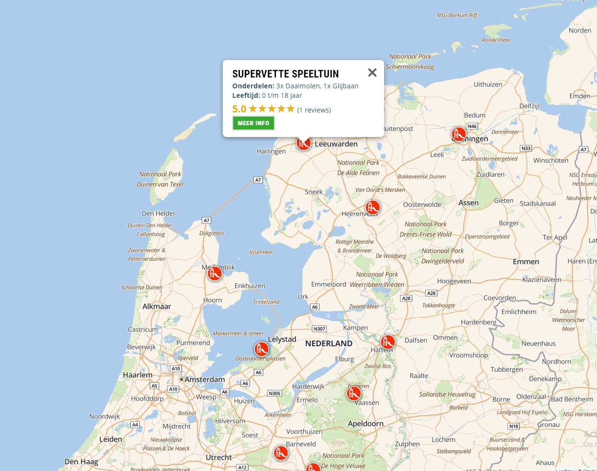
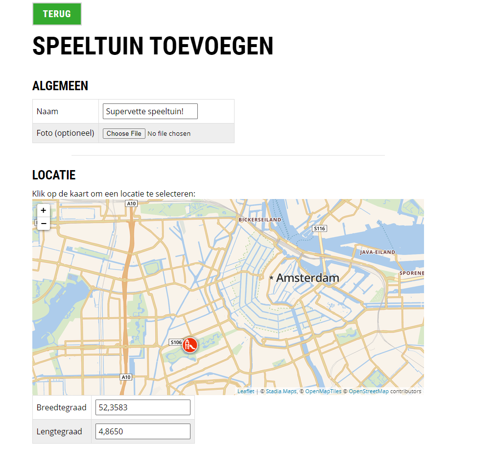
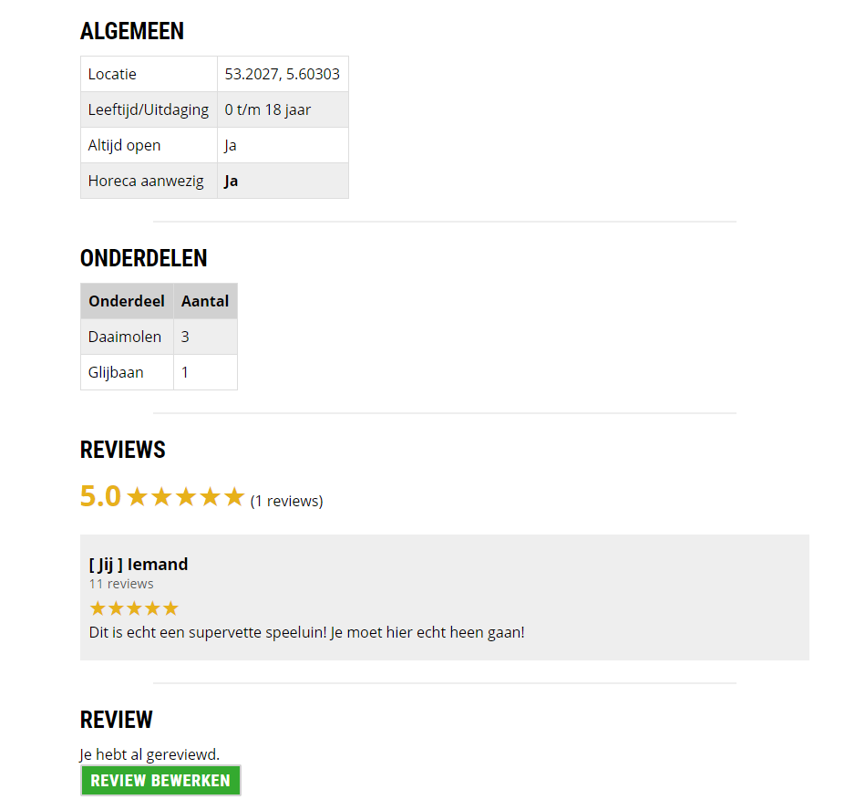

# Playground Website / Informatics project

A __dynamic__ website where users can add, view and rate playgrounds. The playgrounds are shown on a map.
Originally made for an informatics project for school with HTML, CSS, JavaScript, PhP & MySQL. Later expanded into a commercial project.

Visit the website on: www.zoekeenspeeltuin.nl

## Dependencies / Libraries

*Can be found in the `libs` folder*

- [Leaflet](https://leafletjs.com/)
- [noUiSlider](https://refreshless.com/nouislider/)

## Pictures

